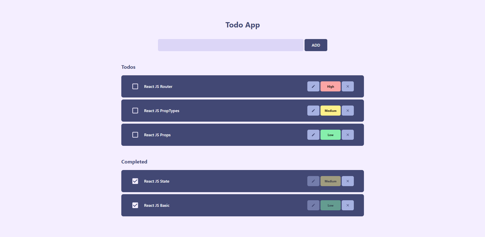

# Todo App

Responsive Todo App using Context API and Local Storage



## Tools Used

1. React JS
2. Tailwind CSS
3. Context API
4. Local Storage
5. React Icons

## Installation

```bash
# Clone the repository
git clone https://github.com/SatyabratDeveloper/ReactTodoApp.git

# Install dependencies
npm install

# Run the project
npm run dev
```
